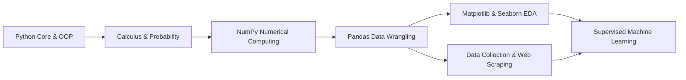

# 🧠 AI & Machine Learning Journey (AIML)

[](https://www.python.org/)
[](https://jupyter.org/)
[](https://numpy.org/)
[](https://pandas.pydata.org/)
[](https://matplotlib.org/)
[](https://seaborn.pydata.org/)
[](https://scikit-learn.org/)

---

## 📌 Overview

Welcome to the **AI & Machine Learning (AIML)** repository! This repository is a comprehensive, hands-on learning roadmap containing code, tutorials, and practical projects covering the essential pillars of modern Data Science and Machine Learning.

It guides learners from core programming and mathematical foundations all the way to data scraping, data wrangling, exploratory data analysis (EDA), and end-to-end Supervised Machine Learning pipelines.

---

## 📂 Repository Structure

The complete directory and file hierarchy is illustrated below:

```mermaid
graph TD
    classDef root fill:#1e293b,stroke:#3b82f6,stroke-width:2px,color:#fff,font-weight:bold;
    classDef folder fill:#0f172a,stroke:#64748b,stroke-width:1px,color:#38bdf8,font-weight:bold;
    classDef file fill:#1e293b,stroke:#475569,stroke-width:1px,color:#cbd5e1;

    Root["📁 AIML (Root)"]:::root

    %% Core Modules
    PyMod["🐍 Python/"]:::folder
    CalcMod["📐 Calculas/"]:::folder
    ProbMod["🎲 Probability/"]:::folder
    NumMod["🔢 First Project/ (NumPy)"]:::folder
    PanMod["🐼 Pandas/"]:::folder
    VisMod["📊 Matplotlib/ & Seaborn"]:::folder
    DataColMod["🌐 Data_Collection/"]:::folder
    MLMod["🤖 Supervised ML/"]:::folder

    Root --> PyMod
    Root --> CalcMod
    Root --> ProbMod
    Root --> NumMod
    Root --> PanMod
    Root --> VisMod
    Root --> DataColMod
    Root --> MLMod

    %% Python Details
    PyMod --> Py1["Exception.py, ListComprehensions.py"]:::file
    PyMod --> Py2["OOPs/ & Notes/"]:::file

    %% Calculus Details
    CalcMod --> Calc1["Calculas.ipynb & calculus.ipynb"]:::file

    %% Probability Details
    ProbMod --> Prob1["probab_dist.ipynb"]:::file

    %% NumPy Details
    NumMod --> Num1["Create_numpy.ipynb & numpy_tutorial.ipynb"]:::file
    NumMod --> Num2["thinking_data.ipynb & store_data.json"]:::file

    %% Pandas Details
    PanMod --> Pan1["pandas_tutorial.ipynb & pandas_tutorial2.ipynb"]:::file
    PanMod --> Pan2["Datasets: employee_data, globalAirQuality, raw_data"]:::file

    %% Matplotlib & Seaborn Details
    VisMod --> Vis1["1-matplotlib_tutorial.ipynb & matplotlib_tutorial.ipynb"]:::file
    VisMod --> Vis2["Seaborn.ipynb & seaborn_tutorial.ipynb"]:::file
    VisMod --> Vis3["sample_lineplot.py"]:::file

    %% Data Collection Details
    DataColMod --> DC1["data_collection.ipynb & scraping_activity.ipynb"]:::file
    DataColMod --> DC2["scraped_data/ & cleaned_data/"]:::file

    %% Supervised ML Details
    MLMod --> ML1["linerar_regression.ipynb"]:::file
    MLMod --> ML2["medical-cost-personal-datasets.ipynb"]:::file
    MLMod --> ML3["insurance.csv"]:::file
```



### 🗂️ Detailed Directory Breakdown

| Directory | Description | Key Contents |
| :--- | :--- | :--- |
| **`Python/`** | Python language fundamentals and OOP patterns | `OOPs/`, `Notes/`, `Exception.py`, `ListComprehensions.py` |
| **`Calculas/`** | Calculus foundations for optimization & ML | `Calculas.ipynb`, `calculus.ipynb` |
| **`Probability/`** | Statistical distributions & random variables | `probab_dist.ipynb` |
| **`First Project/`** | Scientific computing & array operations with NumPy | `Create_numpy.ipynb`, `numpy_tutorial.ipynb`, `thinking_data.ipynb` |
| **`Pandas/`** | Data wrangling, tabular manipulation & cleaning | `pandas_tutorial.ipynb`, `pandas_tutorial2.ipynb`, CSV & JSON datasets |
| **`Matplotlib/`** | Data visualization & statistical plotting | Matplotlib & Seaborn notebooks, `sample_lineplot.py` |
| **`Data_Collection/`** | Web scraping & automated ETL pipelines | `data_collection.ipynb`, `scraping_activity.ipynb`, `scraped_data/`, `cleaned_data/` |
| **`Supervised ML/`** | Supervised learning algorithms & case studies | `linerar_regression.ipynb`, `medical-cost-personal-datasets.ipynb`, `insurance.csv` |

---

## 🎯 Modules & Key Concepts

### 1. 🐍 Python Core & OOP (`Python/`)

- Object-Oriented Programming principles (Classes, Inheritance, Encapsulation, Polymorphism).
- Exception handling, list comprehensions, and Pythonic best practices.

### 2. 📐 Mathematical Foundations (`Calculas/` & `Probability/`)

- **Calculus:** Limits, continuous functions, derivatives, partial derivatives, chain rule, and Gradient Descent optimization intuition.
- **Probability & Statistics:** Discrete & continuous probability distributions (Gaussian/Normal, Binomial, Poisson), expected values, variance, and standard deviation.

### 3. 🔢 Scientific Computing & Array Manipulation (`First Project/`)

- **NumPy:** N-dimensional arrays, vectorized arithmetic, broadcasting mechanics, linear algebra basics, indexing, and slicing.

### 4. 🐼 Data Wrangling & Analysis (`Pandas/`)

- **Pandas DataFrames & Series:** Loading heterogeneous sources (CSV, JSON), indexing, slicing, boolean masking, missing value imputation, multi-level aggregation, and `groupby` transformations.

### 5. 📊 Visual Analytics & EDA (`Matplotlib/`)

- **Matplotlib:** Customizing figure aesthetics, line charts, bar plots, subplots, and annotations.
- **Seaborn:** Distribution plots (KDE, Histograms), categorical plots (Box, Violin), and correlation heatmaps for feature selection.

### 6. 🌐 Data Acquisition & Web Scraping (`Data_Collection/`)

- Web scraping with `requests` and `BeautifulSoup`.
- Handling HTTP requests, HTML element parsing, and pagination handling.
- Automated ETL pipeline transforming unstructured HTML into structured tabular data (`data.csv`).

### 7. 🤖 Supervised Machine Learning (`Supervised ML/`)

- Simple and Multiple Linear Regression from scratch and via Scikit-Learn.
- Feature engineering, train-test splitting, and feature scaling.
- Evaluation metrics: Mean Absolute Error (MAE), Mean Squared Error (MSE), Root Mean Squared Error (RMSE), and $R^2$ Score.
- **Real-World Case Study:** Predicting medical insurance costs (`insurance.csv`).

---

## 📈 Learning Pathway



---

## 🛠️ Tech Stack & Requirements

- **Language:** Python 3.9+
- **Interactive Computing:** Jupyter Notebook / JupyterLab
- **Key Libraries:**
  - `numpy`
  - `pandas`
  - `matplotlib`
  - `seaborn`
  - `scikit-learn`
  - `beautifulsoup4`
  - `requests`

---

## 🚀 Getting Started

### 1. Clone the Repository

```bash
git clone https://github.com/raghuvanshi-sec/AIML.git
cd AIML
```

### 2. Set Up a Virtual Environment

**Using `venv`:**

```bash
python -m venv .venv
# On Windows:
.venv\Scripts\activate
# On macOS/Linux:
source .venv/bin/activate
```

**Or using Conda:**

```bash
conda create -n aiml_env python=3.10 -y
conda activate aiml_env
```

### 3. Install Dependencies

```bash
pip install numpy pandas matplotlib seaborn scikit-learn beautifulsoup4 requests jupyter
```

### 4. Launch Jupyter Notebook

```bash
jupyter notebook
```

Navigate to any topic folder (e.g., `Supervised ML/` or `Pandas/`) and open the respective `.ipynb` file to run interactive cells.

---

## 🤝 Contributing

Contributions, improvements, and feedback are welcome!

1. Fork the repository
2. Create your feature branch (`git checkout -b feature/AmazingFeature`)
3. Commit your changes (`git commit -m 'Add some AmazingFeature'`)
4. Push to the branch (`git push origin feature/AmazingFeature`)
5. Open a Pull Request

---

## 📄 License

This repository is distributed under the [MIT License](LICENSE).
