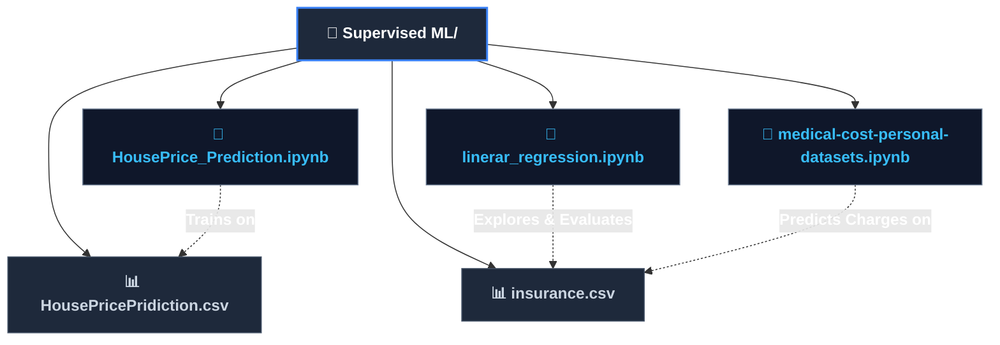
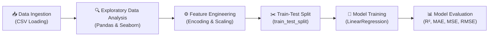

# 🤖 Supervised Machine Learning Module

[](https://www.python.org/)
[](https://scikit-learn.org/)
[](https://pandas.pydata.org/)
[](https://numpy.org/)
[](https://jupyter.org/)

---

## 📌 Overview

This directory contains practical implementations, notebooks, and case studies for **Supervised Machine Learning**, with a dedicated focus on **Regression Algorithms**, feature engineering, data preprocessing, and model evaluation metrics.

Here, you will find end-to-end machine learning workflows that transition raw tabular datasets into trained, validated predictive models.

---

## 📂 Directory Structure



### 🗂️ File Inventory

| File | Type | Description |
| :--- | :--- | :--- |
| **`HousePrice_Prediction.ipynb`** | Jupyter Notebook | End-to-end House Price Prediction using regression, EDA, categorical encoding, and feature correlation. |
| **`HousePricePridiction.csv`** | Dataset | Real estate dataset with structural and contextual housing features (`LotArea`, `YearBuilt`, `BldgType`, `SalePrice`, etc.). |
| **`linerar_regression.ipynb`** | Jupyter Notebook | In-depth exploration of Simple and Multiple Linear Regression models, train-test splitting, and residual analysis. |
| **`medical-cost-personal-datasets.ipynb`** | Jupyter Notebook | Medical insurance cost prediction pipeline covering exploratory analysis, distribution plots, label encoding, and regression modeling. |
| **`insurance.csv`** | Dataset | Demographic and health factors (`age`, `bmi`, `smoker`, `children`, `region`) used to predict individual medical `charges`. |

---

## 🔄 Machine Learning Pipeline

Each case study follows a standardized, modular end-to-end ML workflow:



---

## 🎯 Case Studies & Notebook Details

### 1. 🏠 House Price Prediction (`HousePrice_Prediction.ipynb`)

- **Objective:** Predict real estate sale prices (`SalePrice`) based on property dimensions, construction year, zoning, and building types.
- **Workflow:**
  - Data inspection, handling null values, and summary statistics.
  - Correlation heatmaps and feature filtering against `SalePrice`.
  - Categorical feature transformation using One-Hot and Label Encoding.
  - Splitting data using `train_test_split` (80/20 train-test ratio).
  - Training `LinearRegression` model.
  - Evaluating performance with $R^2$, MAE, MSE, and RMSE.
  - Scatter plots of Actual vs. Predicted values.

### 2. 🏥 Medical Cost Personal Dataset (`medical-cost-personal-datasets.ipynb`)

- **Objective:** Predict individual medical healthcare insurance charges (`charges`) based on personal health attributes.
- **Workflow:**
  - Univariate distribution analysis of `age`, `bmi`, and `charges`.
  - Bivariate analysis examining smoking habits vs. cost impact.
  - Categorical transformation of `sex`, `smoker`, and `region` using `LabelEncoder`.
  - Training and validating regression models with Scikit-Learn.

### 3. 📈 Linear Regression Foundations (`linerar_regression.ipynb`)

- **Objective:** Deep dive into the mechanics of Linear Regression models.
- **Concepts Covered:**
  - Cost function minimization via Ordinary Least Squares (OLS).
  - Feature selection and multicollinearity considerations.
  - Model coefficient ($\beta_i$) and intercept ($\beta_0$) interpretation.
  - Residual diagnostics and goodness-of-fit evaluation.

---

## 📐 Evaluation Metrics Reference

| Metric | Formula | Interpretation |
| :--- | :--- | :--- |
| **$R^2$ Score (Coefficient of Determination)** | $$R^2 = 1 - \frac{\sum (y_i - \hat{y}_i)^2}{\sum (y_i - \bar{y})^2}$$ | Proportion of variance in the target variable explained by the model (values closer to 1.0 indicate better fit). |
| **MAE (Mean Absolute Error)** | $$\text{MAE} = \frac{1}{n}\sum_{i=1}^n \|y_i - \hat{y}_i\|$$ | Average magnitude of errors in the same units as the target variable. |
| **MSE (Mean Squared Error)** | $$\text{MSE} = \frac{1}{n}\sum_{i=1}^n (y_i - \hat{y}_i)^2$$ | Penalizes larger errors more heavily due to squaring. |
| **RMSE (Root Mean Squared Error)** | $$\text{RMSE} = \sqrt{\text{MSE}}$$ | Square root of MSE, providing error scale in target units. |

---

## 🚀 How to Run

1. **Activate your environment** from the root repository:

   ```bash
   # Using venv:
   .venv\Scripts\activate

   # Or using Conda:
   conda activate aiml_env
   ```

2. **Launch Jupyter:**

   ```bash
   jupyter notebook
   ```

3. Open any `.ipynb` file in this directory and execute the cells sequentially.
